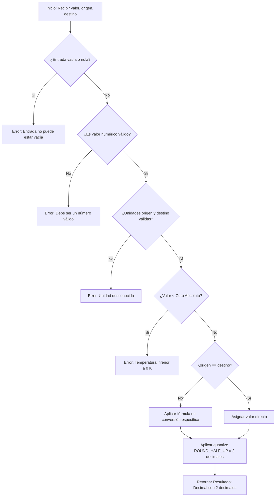

# Data Model: Conversor de Temperatura

**Feature**: `001-conversor-temperatura`  
**Date**: 2026-09-16  

---

## 1. Entidades y Estructuras de Datos

### UnidadTemperatura (Enumeración / Tipado)
Representa las unidades métricas de temperatura admitidas por el conversor.

- **Valores válidos**:
  - `C`: Grados Celsius
  - `F`: Grados Fahrenheit
  - `K`: Kelvin
- **Reglas de normalización**:
  - Acepta cadenas en mayúsculas o minúsculas (`'c'`, `'f'`, `'k'`).
  - Espacios en blanco circundantes son eliminados automáticamente.

---

### SolicitudConversion (Modelo de Entrada)
Representa los datos requeridos para efectuar una transformación de temperatura.

| Campo | Tipo | Requerido | Descripción | Reglas de Validación |
|---|---|---|---|---|
| `valor` | `Union[int, float, str, Decimal]` | Sí | Valor numérico de la temperatura a convertir. | No nulo (`None`), no vacío, parseable a número decimal. Mayor o igual al cero absoluto para la unidad `origen`. |
| `origen` | `str` / `UnidadTemperatura` | Sí | Unidad de la temperatura provista. | Debe ser una de: `'C'`, `'F'`, `'K'`. |
| `destino` | `str` / `UnidadTemperatura` | Sí | Unidad hacia la cual transformar. | Debe ser una de: `'C'`, `'F'`, `'K'`. |

---

### ResultadoConversion (Modelo de Salida)
Representa la respuesta calculada y validada por el sistema.

| Campo | Tipo | Descripción | Restricciones de Formato |
|---|---|---|---|
| `valor` | `Decimal` | Magnitud numérica convertida. | Redondeada a exactamente dos (2) cifras decimales (`ROUND_HALF_UP`). |
| `unidad` | `str` | Unidad de medida de destino normalizada (`'C'`, `'F'`, `'K'`). | Mayúscula única. |

---

### ErrorConversion (Modelo de Excepción)
Representa una falla controlada de validación o infracción de leyes físicas.

- **Tipo base**: `ValueError`
- **Atributos**:
  - `mensaje`: Explicación en texto claro para el usuario.
- **Categorías de error**:
  1. *Entrada vacía*: `"La entrada no puede estar vacía."`
  2. *Entrada no numérica*: `"La entrada debe ser un número válido."`
  3. *Unidad no reconocida*: `"Unidad no válida: '{unidad}'. Debe ser 'C', 'F' o 'K'."`
  4. *Temperatura inferior al cero absoluto*: `"La temperatura no puede ser inferior al cero absoluto (0 Kelvin)."`

---

## 2. Límites Físicos y Reglas de Validación

| Unidad | Símbolo | Límite Físico Mínimo (Cero Absoluto) | Fórmula de Validación |
|---|---|---|---|
| **Kelvin** | `K` | $0.00\text{ K}$ | $V \ge 0$ |
| **Celsius** | `C` | $-273.15\text{ }^\circ\text{C}$ | $V \ge -273.15$ |
| **Fahrenheit** | `F` | $-459.67\text{ }^\circ\text{F}$ | $V \ge -459.67$ |

---

## 3. Flujo de Estados y Ciclo de Vida de una Conversión

