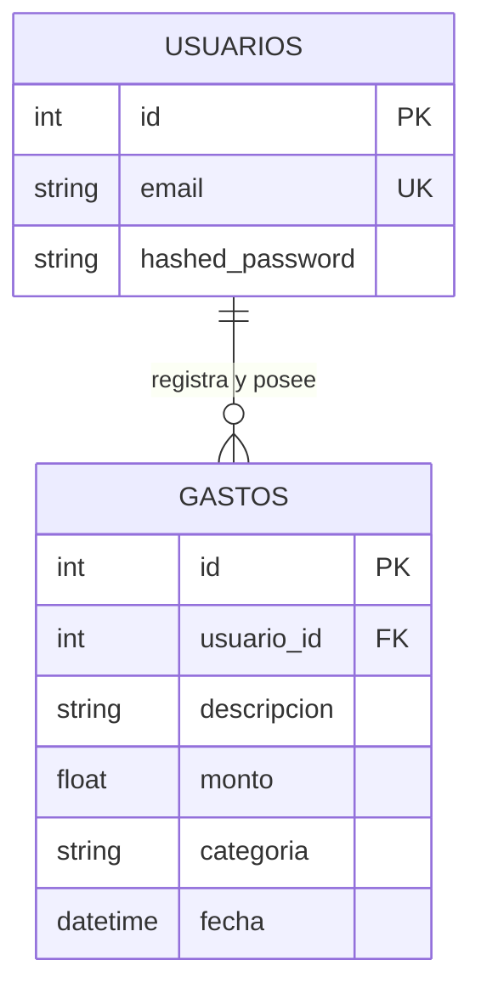

# Data Model & Schema Design: Sistema de Control de Gastos Personales

Este documento define la estructura de datos, entidades SQLAlchemy, esquemas Pydantic y reglas de validación para el sistema.

---

## 1. Entidades de Dominio y Persistencia (SQLAlchemy)

### 1.1 Modelo `Usuario` (`app/models/usuario.py`)
Representa la cuenta de un usuario en el sistema.

- **Tabla**: `usuarios`
- **Atributos**:
  - `id`: `Integer`, Primary Key, autoincremental, índice.
  - `email`: `String(255)`, No nulo, único, índice. Correo electrónico del usuario.
  - `hashed_password`: `String(255)`, No nulo. Hash seguro generado mediante bcrypt.
- **Relaciones**:
  - `gastos`: Relación 1 a N con `Gasto` (`back_populates="usuario"`, `cascade="all, delete-orphan"`).
- **Invariantes**:
  - El email es estrictamente único en la base de datos.
  - La contraseña nunca se almacena en texto plano.

### 1.2 Modelo `Gasto` (`app/models/gasto.py`)
Representa una transacción de gasto registrada por un usuario.

- **Tabla**: `gastos`
- **Atributos**:
  - `id`: `Integer`, Primary Key, autoincremental, índice.
  - `usuario_id`: `Integer`, Foreign Key (`usuarios.id`), No nulo, índice.
  - `descripcion`: `String(255)`, No nulo. Detalle del consumo.
  - `monto`: `Float`, No nulo. Valor monetario de la transacción.
  - `categoria`: `String(50)`, No nulo, índice. Clasificación del gasto.
  - `fecha`: `DateTime(timezone=True)`, No nulo, `server_default=func.now()`.
- **Relaciones**:
  - `usuario`: Relación N a 1 con `Usuario` (`back_populates="gastos"`).
- **Invariantes y Restricciones**:
  - `monto > 0.0`.
  - `categoria` debe pertenecer al conjunto permitido: `['comida', 'transporte', 'entretenimiento', 'otros']`.
  - Todo registro pertenece obligatoriamente a un `usuario_id` existente.

---

## 2. Esquemas Pydantic (Validación y Serialización)

Se asegura la separación obligatoria entre esquemas de entrada y salida (Artículo V.3).

### 2.1 Esquemas de Usuario (`app/schemas/usuario.py`)

```python
from pydantic import BaseModel, EmailStr, ConfigDict

class UsuarioCreate(BaseModel):
    email: EmailStr
    password: str

class UsuarioOut(BaseModel):
    id: int
    email: EmailStr

    model_config = ConfigDict(from_attributes=True)

class Token(BaseModel):
    access_token: str
    token_type: str = "bearer"

class TokenData(BaseModel):
    email: str | None = None
    usuario_id: int | None = None
```

### 2.2 Esquemas de Gasto (`app/schemas/gasto.py`)

```python
from pydantic import BaseModel, Field, field_validator
from datetime import datetime
from typing import Literal

CATEGORIAS_VALIDAS = ("comida", "transporte", "entretenimiento", "otros")

class GastoCreate(BaseModel):
    descripcion: str = Field(..., min_length=1, max_length=255)
    monto: float = Field(..., gt=0)
    categoria: str

    @field_validator("descripcion")
    @classmethod
    def validar_descripcion_no_vacia(cls, v: str) -> str:
        if not v.strip():
            raise ValueError("La descripción no puede estar vacía ni contener solo espacios")
        return v.strip()

    @field_validator("categoria")
    @classmethod
    def validar_categoria(cls, v: str) -> str:
        cat = v.strip().lower()
        if cat not in CATEGORIAS_VALIDAS:
            raise ValueError(f"Categoría inválida: {v}. Permitidas: {', '.join(CATEGORIAS_VALIDAS)}")
        return cat

class GastoOut(BaseModel):
    id: int
    usuario_id: int
    descripcion: str
    monto: float
    categoria: str
    fecha: datetime | str

    model_config = ConfigDict(from_attributes=True)
```

---

## 3. Contratos de Datos de la Capa de Repositorios

Los repositorios NUNCA devuelven instancias ORM a los servicios (Artículo I.3, compatibilidad con Sesiones 6-8). Devuelven diccionarios planos:

### Formato de Diccionario de `Gasto`
```python
{
    "id": int,
    "usuario_id": int,
    "descripcion": str,
    "monto": float,
    "categoria": str,
    "fecha": str  # Formato ISO 8601 o representativo
}
```

### Firmas del Repositorio de Gastos (`app/repositories/gastos.py`):
- `guardar(db, usuario_id: int, descripcion: str, monto: float, categoria: str) -> dict`
- `listar(db, usuario_id: int, skip: int = 0, limit: int = 20) -> list[dict]`
- `total_por_categoria(db, usuario_id: int, categoria: str) -> float`

### Firmas del Repositorio de Usuarios (`app/repositories/usuarios.py`):
- `obtener_por_email(db, email: str) -> Usuario | None`
- `guardar(db, email: str, hashed_password: str) -> Usuario`

---

## 4. Diagrama Entidad-Relación


