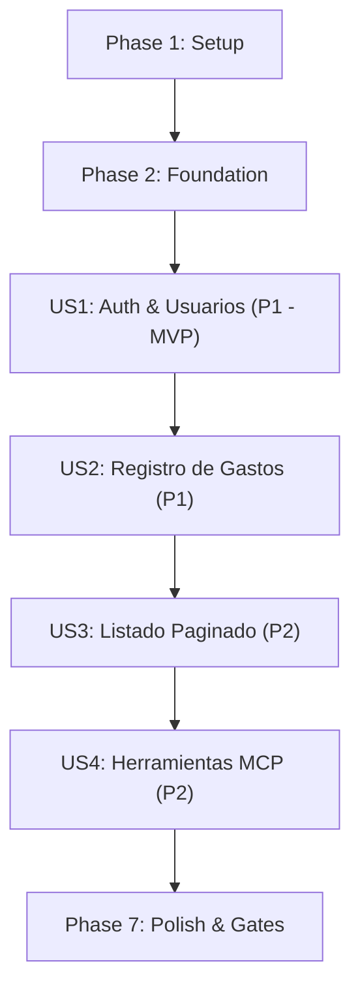

# Tasks: Sistema de Control de Gastos Personales

**Feature**: `001-control-gastos`  
**Input**: Feature Specification (`spec.md`), Implementation Plan (`plan.md`), Data Model (`data-model.md`), External Contracts (`contracts/`), Research (`research.md`), Quickstart Guide (`quickstart.md`).  
**Status**: Ready for implementation.

---

## Phase 1: Setup (Shared Infrastructure)

**Purpose**: Inicialización del proyecto, dependencias y estructura base de carpetas y archivos.

- [X] T001 Crear estructura completa de directorios del proyecto (`app/models`, `app/schemas`, `app/repositories`, `app/services`, `app/routers`, `app/utils`, `app/mcp/tools`, `alembic/versions`, `tests/unit`, `tests/integration`, `tests/api`) en la raíz del repositorio.
- [X] T002 Configurar dependencias de desarrollo y producción en `pyproject.toml` (Python 3.12, FastAPI, SQLAlchemy 2.0+, Alembic, Pydantic v2, pydantic-settings, passlib[bcrypt], PyJWT, mcp[cli]<2, pytest, pytest-cov, httpx).
- [X] T003 [P] Crear archivo de plantilla de entorno `.env.example` con `SECRET_KEY`, `DATABASE_URL=sqlite:///./gastos.db`, `ACCESS_TOKEN_EXPIRE_MINUTES=60` y `DEMO_USER_ID=1`.
- [X] T004 [P] Crear el archivo base de tests `tests/__init__.py` requerido explícitamente por el contrato de compatibilidad.

---

## Phase 2: Foundational (Blocking Prerequisites)

**Purpose**: Infraestructura bloqueante que DEBE estar completada antes de iniciar las historias de usuario.

**⚠️ CRITICAL**: Ninguna historia de usuario puede implementarse hasta completar esta fase.

- [X] T005 Implementar gestión de configuración con `pydantic-settings` en `app/config.py` leyendo `SECRET_KEY`, `DATABASE_URL`, `ACCESS_TOKEN_EXPIRE_MINUTES` y `DEMO_USER_ID`.
- [X] T006 Implementar conexión y sesión de base de datos SQLAlchemy con `connect_args={"check_same_thread": False}` condicional para SQLite y generador `get_db` en `app/database.py`.
- [X] T007 [P] Implementar utilidades criptográficas puras para hashing de contraseñas (`passlib[bcrypt]`) y generación/validación de tokens JWT (`PyJWT` con HS256) en `app/utils/security.py`.
- [ ] T008 Configurar entorno de migraciones Alembic (`alembic/env.py` y `alembic.ini`) conectado a los modelos SQLAlchemy y `DATABASE_URL`.
- [ ] T009 [P] Configurar fixtures compartidas de pytest (`tests/conftest.py`) con base de datos SQLite en memoria, sesión de test, override de `get_db` y cliente `TestClient`.
- [ ] T010 Implementar el contrato y simulación en memoria de `RepositorioFalso` en `tests/unit/test_fakes.py` que emula `guardar`, `listar` y `total_por_categoria` para permitir testing sin `unittest.mock`.

**Checkpoint**: Base del proyecto lista; el desarrollo de historias de usuario puede comenzar.

---

## Phase 3: User Story 1 - Registro y Autenticación de Usuario (Priority: P1) 🎯 MVP

**Goal**: Permitir el registro de usuarios con email único y contraseña protegida por bcrypt, y la obtención de tokens JWT mediante OAuth2 Password Flow.

**Independent Test**: Registrar un usuario con `POST /usuarios/`, verificar que no devuelve el hash de la contraseña, solicitar token en `POST /usuarios/token` y verificar recepción de token Bearer válido; probar credenciales inválidas (401) y email duplicado (400).

### Tests for User Story 1 (TDD - Escribir primero y verificar que fallen) ⚠️

- [ ] T011 [P] [US1] Escribir pruebas unitarias para el servicio de autenticación y hashing en `tests/unit/test_auth_service.py` (verificar creación de hash, verificación de password y generación de token).
- [ ] T012 [P] [US1] Escribir pruebas de integración para el repositorio de usuarios en `tests/integration/test_usuarios_repo.py` (`guardar`, `obtener_por_email` contra SQLite real).
- [ ] T013 [P] [US1] Escribir pruebas de API para `/usuarios/` y `/usuarios/token` en `tests/api/test_auth.py` (201 registro, 400 duplicado, 200 token, 401 credenciales inválidas, 422 schema).

### Implementation for User Story 1

- [ ] T014 [P] [US1] Crear modelo SQLAlchemy `Usuario` en `app/models/usuario.py` con restricciones verbatim: `id: Integer PK`, `email: String(255) unique nullable=False index=True`, `hashed_password: String(255) nullable=False`, y relación `gastos`.
- [ ] T015 [P] [US1] Crear esquemas Pydantic `UsuarioCreate`, `UsuarioOut`, `Token` y `TokenData` en `app/schemas/usuario.py` asegurando `from_attributes=True` y que `UsuarioOut` nunca expone contraseñas ni hashes.
- [ ] T016 [US1] Implementar funciones del repositorio de usuarios en `app/repositories/usuarios.py`: `obtener_por_email(db, email) -> Usuario | None` y `guardar(db, email, hashed_password) -> Usuario`.
- [ ] T017 [US1] Implementar servicio de autenticación y registro de usuarios en `app/services/auth.py` orquestando hashing, verificación y creación de tokens JWT con expiración.
- [ ] T018 [US1] Implementar dependencia `get_current_user` en `app/dependencies.py` decodificando token JWT y resolviendo el usuario autenticado (retorna HTTP 401 si falta o es inválido).
- [ ] T019 [US1] Implementar endpoints `POST /usuarios/` y `POST /usuarios/token` en `app/routers/usuarios.py` delegando exclusivamente a `app/services/auth.py` sin reglas de negocio en el router.

**Checkpoint**: User Story 1 completa y verificada como MVP funcional independiente.

---

## Phase 4: User Story 2 - Registro de Gastos con Validación de Reglas de Negocio (Priority: P1)

**Goal**: Permitir a un usuario autenticado registrar gastos personales validando que el monto sea estrictamente positivo, la categoría sea válida y el acumulado no supere el límite de 500.0 por categoría.

**Independent Test**: Usuario autenticado registra un gasto válido; intentar registrar monto negativo/cero, categoría fuera de las 4 permitidas o gasto que exceda el límite de 500.0 en la categoría, verificando errores HTTP 400 controlados.

### Tests for User Story 2 (TDD - Escribir primero y verificar que fallen) ⚠️

- [ ] T020 [P] [US2] Escribir pruebas unitarias en `tests/unit/test_gastos_service.py` inyectando `RepositorioFalso` (sin `unittest.mock`) cubriendo: monto negativo/cero, descripción vacía, categoría inválida (`CategoriaInvalidaError`), exceso de límite 500 (`LimiteExcedidoError`) y caso exitoso con orden posicional exacto.
- [ ] T021 [P] [US2] Escribir pruebas de integración en `tests/integration/test_gastos_repo.py` para `guardar(db, usuario_id, descripcion, monto, categoria) -> dict` y `total_por_categoria(db, usuario_id, categoria) -> float` verificando retorno en `dict` y persistencia con `usuario_id`.
- [ ] T022 [P] [US2] Escribir pruebas de API para `POST /gastos/` en `tests/api/test_gastos_api.py` (201 creado, 400 categoría inválida, 400 límite excedido, 401 sin token, 422 validación).

### Implementation for User Story 2

- [ ] T023 [P] [US2] Crear modelo SQLAlchemy `Gasto` en `app/models/gasto.py` con restricciones verbatim: `id: Integer PK`, `usuario_id: Integer FK usuarios.id nullable=False index=True`, `descripcion: String(255) nullable=False`, `monto: Float nullable=False (monto > 0)`, `categoria: String(50) nullable=False`, `fecha: DateTime nullable=False`.
- [ ] T024 [P] [US2] Crear esquemas Pydantic `GastoCreate` (con validadores `monto > 0`, `descripcion` no vacía, y categoría en `['comida', 'transporte', 'entretenimiento', 'otros']`) y `GastoOut` en `app/schemas/gasto.py`.
- [ ] T025 [US2] Implementar funciones en `app/repositories/gastos.py`: `guardar(db, usuario_id, descripcion, monto, categoria) -> dict` y `total_por_categoria(db, usuario_id, categoria) -> float` (devolviendo diccionarios planos, nunca modelos ORM).
- [ ] T026 [US2] Implementar en `app/services/gastos.py` las excepciones `CategoriaInvalidaError`, `LimiteExcedidoError`, la constante `LIMITE_POR_CATEGORIA = 500.0`, y la función `registrar_gasto(db, usuario_id, descripcion, monto, categoria, repo=gastos_repository) -> dict` cumpliendo DIP y orden posicional exacto.
- [ ] T027 [US2] Implementar proveedor de dependencia `get_gastos_repo` en `app/dependencies.py` para inyección de repositorios.
- [ ] T028 [US2] Implementar endpoint `POST /gastos/` en `app/routers/gastos.py` autenticado con `get_current_user`, delegando a `registrar_gasto` y traduciendo excepciones de dominio a HTTP 400 con `{"detail": str(e)}`.

**Checkpoint**: User Stories 1 y 2 completadas y funcionales conjuntamente.

---

## Phase 5: User Story 3 - Consulta y Listado Paginado de Gastos Propios (Priority: P2)

**Goal**: Permitir a usuarios autenticados consultar sus propios gastos con paginación (`skip`, `limit`), garantizando aislamiento estricto e ignorando cualquier identificador de usuario externo.

**Independent Test**: Dos usuarios registran gastos distintos; listar gastos con cada token y verificar que cada usuario solo recibe los suyos; intentar pasar `usuario_id` en query/body y verificar que no afecta el filtrado; probar valores de `skip < 0` o `limit <= 0` retornando HTTP 422.

### Tests for User Story 3 (TDD - Escribir primero y verificar que fallen) ⚠️

- [ ] T029 [P] [US3] Escribir pruebas unitarias en `tests/unit/test_gastos_service.py` para `listar_gastos(db, usuario_id, skip=0, limit=20, repo=gastos_repository) -> list[dict]` inyectando `RepositorioFalso` y verificando filtrado por `usuario_id` y paginación.
- [ ] T030 [P] [US3] Escribir pruebas de integración en `tests/integration/test_gastos_repo.py` para `listar(db, usuario_id, skip=0, limit=20) -> list[dict]` verificando filtrado estricto por `usuario_id` y retorno de lista de diccionarios.
- [ ] T031 [P] [US3] Escribir pruebas de API para `GET /gastos/` en `tests/api/test_gastos_api.py` verificando aislamiento multiusuario, 401 sin token, 422 con `skip=-1` o `limit=0`, y comprobación de que pasar `usuario_id` arbitrario en query es ignorado.

### Implementation for User Story 3

- [ ] T032 [US3] Implementar función `listar(db, usuario_id, skip=0, limit=20) -> list[dict]` en `app/repositories/gastos.py` con query filtrada estrictamente por `usuario_id` y paginada con `.offset(skip).limit(limit)`.
- [ ] T033 [US3] Implementar función `listar_gastos(db, usuario_id, skip=0, limit=20, repo=gastos_repository) -> list[dict]` en `app/services/gastos.py` con orden posicional y default DIP.
- [ ] T034 [US3] Implementar endpoint `GET /gastos/` en `app/routers/gastos.py` con validación de query params `skip: int = 0`, `limit: int = 20`, asegurando que el `usuario_id` proviene exclusivamente de `get_current_user`.

**Checkpoint**: User Stories 1, 2 y 3 completas y probadas de forma independiente.

---

## Phase 6: User Story 4 - Interacción Mediante Herramientas MCP (Priority: P2)

**Goal**: Exponer herramientas FastMCP `registrar_gasto` y `listar_gastos` montadas sobre FastAPI vía `streamable-http`, reutilizando directamente las funciones de `app/services/gastos.py` y retornando errores estructurados (`{"error": "..."}`).

**Independent Test**: Invocar herramientas FastMCP con payload válido y verificar ejecución exitosa; invocar con categoría inválida o exceso de límite y verificar retorno de `{"error": "..."}` sin excepciones 500 ni ruptura de sesión.

### Tests for User Story 4 (TDD) ⚠️

- [ ] T035 [P] [US4] Escribir pruebas unitarias e integración para tools MCP en `tests/unit/test_mcp_tools.py` verificando llamadas a `services/gastos.py`, resolución de identidad, formato de retorno estructurado y captura de errores sin lanzar excepciones.

### Implementation for User Story 4

- [ ] T036 [US4] Implementar servidor FastMCP en `app/mcp/server.py` configurando el transporte `streamable-http` y el mecanismo de extracción de token/usuario de la sesión con fallback a `DEMO_USER_ID` para `stdio` (con comentario explícito en código).
- [ ] T037 [US4] Implementar herramientas FastMCP `registrar_gasto(descripcion, monto, categoria)` y `listar_gastos(skip=0, limit=20)` en `app/mcp/tools/gastos.py` delegando exclusivamente a `app/services/gastos.py` y devolviendo errores como `{"error": str(e)}`.
- [ ] T038 [US4] Montar el servidor FastMCP en la aplicación principal FastAPI en `app/main.py` bajo la ruta `/mcp`.

**Checkpoint**: Todas las historias de usuario (1 a 4) completamente implementadas y testeadas.

---

## Phase 7: Polish & Cross-Cutting Concerns

**Purpose**: Mejoras transversales, endurecimiento de seguridad, migraciones y validación global de calidad.

- [ ] T039 [P] Configurar manejador global de excepciones en `app/main.py` para devolver HTTP 500 con `{"detail": "Error interno del servidor"}` ante `Exception` genérica, registrando internamente el log sin exponer tracebacks técnicos (Artículo IV.5).
- [ ] T040 [P] Generar migración inicial de Alembic en `alembic/versions/` para crear tablas `usuarios` y `gastos` con sus índices y claves foráneas.
- [ ] T041 Ejecutar suite completa de tests con reporte de cobertura (`pytest --cov=app --cov-report=term-missing tests/`) verificando 100% de reglas de negocio, ≥ 90% en `app/services/` y ≥ 80% global.
- [ ] T042 Ejecutar validación end-to-end siguiendo `specs/001-control-gastos/quickstart.md` comprobando flujos completos de registro, login, creación de gastos, rechazos de negocio y listado.

---

## Dependencies & Execution Order

### Phase Dependencies

- **Setup (Phase 1)**: Sin dependencias — inicia inmediatamente.
- **Foundational (Phase 2)**: Depende de Phase 1 — BLOQUEA todas las historias de usuario.
- **User Stories (Phase 3+)**: Todas dependen de Phase 2.
  - US1 (Registro/Auth) es P1 y base de identidad.
  - US2 (Registro de gastos) es P1 y depende de US1 para modelos/tokens en tests de API.
  - US3 (Listado paginado) es P2 y depende de US2 para la existencia de entidades de gastos.
  - US4 (MCP Tools) es P2 y depende de US2 y US3 porque reutiliza sus servicios.
- **Polish (Phase 7)**: Depende de la finalización de las historias de usuario.

### User Story Dependencies

### Reglas Dentro de Cada Historia de Usuario

1. **Test-First**: Pruebas unitarias e integración se escriben primero y DEBEN fallar antes de la implementación.
2. **Modelos y Schemas** antes de repositorios y servicios.
3. **Servicios** antes de routers o endpoints.
4. **Verificación de checkpoint** antes de avanzar a la siguiente historia.

---

## Parallel Opportunities

- **Fase 1 (Setup)**: T003 y T004 pueden ejecutarse en paralelo.
- **Fase 2 (Foundational)**: T007 (`security.py`) y T009 (`conftest.py`) pueden desarrollarse en paralelo tras T005/T006.
- **Fase 3 (US1)**:
  - T011, T012 y T013 (tests) pueden escribirse en paralelo.
  - T014 (`Usuario` model) y T015 (`Usuario` schemas) pueden desarrollarse en paralelo.
- **Fase 4 (US2)**:
  - T020, T021 y T022 (tests) pueden escribirse en paralelo.
  - T023 (`Gasto` model) y T024 (`Gasto` schemas) pueden desarrollarse en paralelo.
- **Fase 5 (US3)**:
  - T029, T030 y T031 (tests) pueden escribirse en paralelo.
- **Fase 7 (Polish)**:
  - T039 (error handler) y T040 (migración Alembic) pueden ejecutarse en paralelo.

---

## Implementation Strategy

### MVP First (User Story 1 Only)
1. Completar Fase 1 (Setup).
2. Completar Fase 2 (Foundational).
3. Completar Fase 3 (US1: Registro y Autenticación).
4. **Validación de Checkpoint**: Probar endpoints `/usuarios/` y `/usuarios/token`. Al confirmar su funcionamiento, se tiene un MVP funcional de autenticación segura.

### Incremental Delivery
1. Sumar Fase 4 (US2): El usuario puede registrar gastos con validaciones de 500 y categorías.
2. Sumar Fase 5 (US3): El usuario puede listar y paginar sus gastos aislados.
3. Sumar Fase 6 (US4): Exponer las capacidades financieras a asistentes IA vía FastMCP.
4. Fase 7: Validación de cobertura total y ejecución del checklist de `quickstart.md`.
